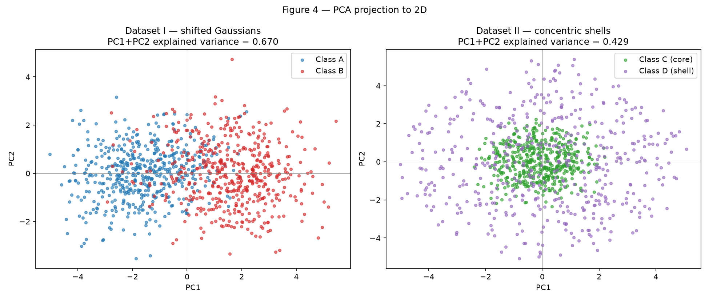
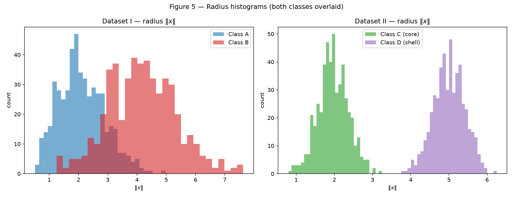
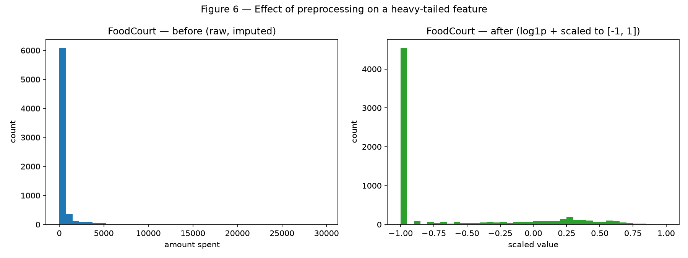

# Data — Preparation and Analysis for Neural Networks

Technical rules used throughout this report: a single fixed random generator
`rng = np.random.default_rng(42)`; every plot has a title, axis labels, and a
class legend; only `numpy`, `pandas`, `matplotlib`/`seaborn`, and `scikit-learn`
(PCA and preprocessing only) are used — no model is trained here.

## Exercise 1

### Point Clouds: Geometry and Spread in 2D

My approach: I draw one fixed set of standard-normal samples and turn it into a
cloud with `x = μ + (s·σ)·z`. Because the base draws `z` are reused for every
scale, `s = 1` reproduces item A exactly and each larger `s` is *the same* cloud
simply spread wider around an unchanged mean — which is what item B asks for. All
numbers below come from the script at the end of the exercise.

### A — Generate the clouds

I generated 400 samples (100 per class) from independent Gaussians with the given
per-axis means and standard deviations:

| Class | Mean | Std |
| --- | --- | --- |
| 0 | \([2, 3]\) | \([0.8, 2.5]\) |
| 1 | \([5, 6]\) | \([1.2, 1.9]\) |
| 2 | \([8, 1]\) | \([0.9, 0.9]\) |
| 3 | \([15, 4]\) | \([0.5, 2.0]\) |

/// caption
Figure 1 — Four Gaussian clouds (\(s = 1\)). The black **X** markers are the
class means \(\mu_0 \dots \mu_3\).
///

The clouds match the parameters: Class 0 is tall and narrow (large \(\sigma_y\)),
Class 2 is compact and round, Class 3 is a thin vertical strip far to the right.

### B — More or less spread out

I regenerated the same four classes at \(s \in \{0.5, 1.0, 2.0, 4.0\}\), scaling
every standard deviation while holding the means fixed. Plotted on shared axes so
the comparison is honest:

/// caption
Figure 2 — The four classes at \(s = 0.5, 1, 2, 4\) on identical axes. At
\(s = 0.5\) the clouds are tight islands; by \(s = 4\) they bleed across the whole
plane.
///

#### Separation ratios \(r_{ij}\) at \(s = 1\)

Using \(\bar{\sigma}_k = (\sigma_{k,x} + \sigma_{k,y})/2\) — so
\(\bar{\sigma} = [1.65, 1.55, 0.90, 1.25]\) — the six pairwise ratios
\(r_{ij} = \lVert \mu_i - \mu_j \rVert / (\bar{\sigma}_i + \bar{\sigma}_j)\) are:

| Pair \((i, j)\) | \(\lVert \mu_i - \mu_j \rVert\) | \(r_{ij}\) |
| --- | --- | --- |
| (0, 1) | 4.243 | **1.326** |
| (1, 2) | 5.831 | 2.380 |
| (0, 2) | 6.325 | 2.480 |
| (2, 3) | 7.616 | 3.542 |
| (1, 3) | 10.198 | 3.642 |
| (0, 3) | 13.038 | 4.496 |

The **smallest** ratio is the pair **(0, 1)** at \(r_{01} = 1.326\) — Classes 0
and 1 are the closest relative to their spread, exactly the overlap visible in
Figure 1. Since the means are fixed, \(r_{ij}\) scales with \(1/s\), so at
\(s = 2\) this smallest ratio halves to \(r_{01} = 0.663\) — no new data needed.

#### Mixing rate per scale

The mixing rate is the fraction of points whose nearest class **mean** is not
their own class (a purely geometric check against the four fixed means, nothing
trained):

| \(s\) | Mixing rate |
| --- | --- |
| 0.5 | 0.0025 |
| 1.0 | 0.0500 |
| 2.0 | 0.2025 |
| 4.0 | 0.4300 |

/// caption
Figure 3 — Mixing rate vs. \(s\). It climbs from essentially zero to 43% as the
clouds spread.
///

**From which scale can the clouds no longer be separated by straight lines?**
From \(s = 2\) onward. At \(s = 0.5\) and \(s = 1\) the mixing rate is tiny
(0.25% and 5%), so a set of straight-line boundaries still separates the classes
with only marginal error; at \(s = 2\) the mixing rate jumps to ~20% and the
clouds visibly interpenetrate in Figure 2, so no set of straight lines can
cleanly separate them. **What happens to the smallest \(r_{ij}\) there?** It falls
below 1 — \(r_{01} = 0.663\) at \(s = 2\) — meaning the gap between the two
closest centers is now *smaller* than the sum of their average spreads: the two
clouds overlap by construction.

### C — Analysis

**1. Overlap at \(s = 1\), and linear separability.** In the original dataset the
four clouds are mostly distinct, but Classes 0 and 1 overlap along the
\(x_1 \approx 3\text{–}6\) band (their \(r_{01} = 1.326\) is the smallest ratio),
and Class 1 brushes Class 2 near the bottom. Class 3 sits far to the right,
cleanly apart. A **single** linear boundary cannot separate all four classes: one
hyperplane only cuts the plane into two half-planes, and we have four regions.
A **set** of linear boundaries, however, can — the 5% mixing rate at \(s = 1\)
shows the classes are almost linearly separable, so a small number of straight
cuts (or the piecewise-linear boundaries an MLP learns) does the job with little
error.

**2. Sketched decision boundaries.** A trained network would carve the plane into
one region per class. The nearest-mean (Voronoi) partition is a good sketch of
what those piecewise-linear boundaries look like:

/// caption
Sketched decision boundaries — the nearest-centroid partition at \(s = 1\).
Each region is bounded by straight segments; only the handful of points on the
wrong side of the Class 0 / Class 1 border are misclassified.
///

**3. Relation to item B.** As the clouds spread (larger \(s\)), the region where
the network *necessarily* makes mistakes — the zone where two classes' points
genuinely overlap — grows. The boundaries barely move (the means are fixed), but
more points cross to the wrong side of them: this is precisely the mixing rate
rising from 0.25% at \(s = 0.5\) to 43% at \(s = 4\) in Figure 3. Beyond
\(s \approx 2\), where \(r_{01} < 1\), the overlap is unavoidable for any
boundary, straight or curved: the irreducible (Bayes) error region widens with
the spread.

### Code

The full, runnable code is the Jupyter notebook
[`code/ex1_point_clouds.ipynb`](code/ex1_point_clouds.ipynb) (rendered as
**Data — Ex. 1 (notebook)** in the navigation). It regenerates every figure above
and prints all the reported numbers, and runs top-to-bottom from a clean checkout.

## Exercise 2

### Non-Linearity in Higher Dimensions

My approach: build two 5-D, two-class datasets and contrast them. **Dataset I**
separates the classes by *location* (a mean shift), so it is essentially linearly
separable; **Dataset II** separates them by *radius* (concentric shells), so no
hyperplane can separate it even though a single quadratic feature can. All numbers
come from the notebook linked at the end.

### A — Dataset I: shifted Gaussians

I drew 500 samples per class from multivariate normals: Class A at
\(\mu_A = [0,0,0,0,0]\) and Class B at \(\mu_B = [1.5,1.5,1.5,1.5,1.5]\), with the
given covariances. Class B has larger variances and a **negative** correlation
between the first two features, whereas Class A's is positive. This yields a
\((1000, 5)\) matrix.

### B — Dataset II: concentric shells

I drew directions uniformly on the unit sphere of \(\mathbb{R}^5\)
(\(v \sim \mathcal{N}(0, I_5)\), then \(u = v/\lVert v \rVert\)) and scaled each by
a random radius: Class C (core) with \(\rho \sim \mathcal{N}(2.0, 0.4)\) and
Class D (shell) with \(\rho \sim \mathcal{N}(5.0, 0.4)\), so \(x = \rho \, u\). I
read the second parameter as a **standard deviation** of \(0.4\). This also yields
a \((1000, 5)\) matrix, but with radial rather than location structure.

### C — Visualize and compare

/// caption
Figure 4 — PCA to 2D. Dataset I (left) splits cleanly along PC1; Dataset II
(right) shows the core (green) buried inside the shell (purple) — a linear
projection cannot pull them apart.
///

**Explained variance of the first two components:**

| Dataset | PC1 | PC2 | PC1 + PC2 |
| --- | --- | --- | --- |
| I — shifted Gaussians | 0.513 | 0.158 | **0.670** |
| II — concentric shells | 0.216 | 0.213 | **0.429** |

The 2D projection preserves the classification-relevant information far better for
**Dataset I**: its largest direction of variance (PC1) coincides with the
mean-shift direction, so the classes split left/right in Figure 4. Dataset II is
roughly isotropic, so its variance is spread almost evenly across all five axes
(hence only 0.429 in two of them), and — crucially — the discriminative signal is
radial, which no linear axis captures, so the classes stay superimposed.

**Distance between class centers (in 5D)** and the radius histograms:

| Dataset | \(\lVert \mu_1 - \mu_2 \rVert\) |
| --- | --- |
| I — shifted Gaussians | **3.264** |
| II — concentric shells | **0.266** |

/// caption
Figure 5 — Radius \(\lVert x \rVert\) per class. Dataset I overlaps; Dataset II is
perfectly separated in radius (\(\approx 2\) vs. \(\approx 5\)) despite its class
centers nearly coinciding.
///

### D — Analysis

**1. Coincident centers + separated radii.** In Dataset II the class centers are
essentially the same point (distance \(0.266\), versus \(3.264\) for Dataset I),
yet the radius histograms are completely disjoint. A hyperplane separates by
*location* — which side of a flat boundary a point falls on — but here both
classes share the same center and are spherically symmetric, so **no hyperplane
can separate them**. The signal lives in the distance from the origin, a quantity
a linear boundary cannot see.

**2. Why no linear boundary works, ever.** For any hyperplane \(w \cdot x = b\),
project the data onto \(w\): since \(x = \rho\,u\) with \(u\) uniform on the
sphere, \(w \cdot x = \rho\,(w \cdot u)\), and \(w \cdot u\) is symmetric about
\(0\) with the *same shape* for both classes — only rescaled by \(\rho\). So both
classes project to zero-mean, overlapping distributions (the shell just has
heavier tails), and any threshold \(b\) misclassifies a large fraction. More data
cannot fix this: it is a structural property — the core is **enclosed** by the
shell, and a linear model can only ever carve out a single half-space, never an
"inside vs. outside."

**3. Does a mixed PCA view prove inseparability? No.** PCA is a *linear*
transformation, so a projection in which the classes look mixed (Figure 4, right;
only \(0.429\) variance retained) proves only that **no linear view** separates
them — not that no function does. My own results confirm this: the same Dataset II
is separated **perfectly** by a single quadratic feature,
\(f(x) = \lVert x \rVert^2 = \sum_i x_i^2\). Thresholding at radius \(3.5\)
(i.e. \(f(x) = 12.25\)) — "predict shell when \(\sum_i x_i^2 > 12.25\)" — gives
**accuracy \(1.0000\)** on the 1000 points.

### Code

The full, runnable code is the Jupyter notebook
[`code/ex2_nonlinearity.ipynb`](code/ex2_nonlinearity.ipynb) (rendered as
**Data — Ex. 2 (notebook)** in the navigation). It generates both datasets,
produces Figures 4 and 5, and prints every reported number.

## Exercise 3

### Preparing Real-World Data for a Neural Network

My approach: preprocess the Kaggle **Spaceship Titanic** dataset for a network with
`tanh` hidden layers, which means every input must end up on a bounded,
`tanh`-compatible scale. Crucially, every transformation statistic is fit on the
training split only, so no test information leaks into the pipeline. (The data is
`train.csv`; the notebook loads a local copy and falls back to a public mirror.)

### A — Get to know the data

**Goal.** Each row is a passenger; the target `Transported` is a boolean — whether
the passenger was transported to another dimension during the spacetime anomaly. It
is the binary label a classifier predicts. The classes are almost perfectly
balanced: **True = 0.5036**, False = 0.4964.

**Features** (raw shape \((8693, 14)\)):

- **Numerical:** `Age`, `RoomService`, `FoodCourt`, `ShoppingMall`, `Spa`, `VRDeck`
- **Categorical:** `HomePlanet`, `CryoSleep`, `Cabin`, `Destination`, `VIP`, `Name`
- **Identifier (dropped):** `PassengerId`

**Missing values** (every column is missing ~2%):

| Column | Missing count | Missing % |
| --- | --- | --- |
| CryoSleep | 217 | 2.50 |
| ShoppingMall | 208 | 2.39 |
| VIP | 203 | 2.34 |
| HomePlanet | 201 | 2.31 |
| Name | 200 | 2.30 |
| Cabin | 199 | 2.29 |
| VRDeck | 188 | 2.16 |
| FoodCourt | 183 | 2.11 |
| Spa | 183 | 2.11 |
| Destination | 182 | 2.09 |
| RoomService | 181 | 2.08 |
| Age | 179 | 2.06 |

**Spending columns** — mean, median, maximum (full dataset):

| Column | Mean | Median | Max |
| --- | --- | --- | --- |
| RoomService | 224.69 | 0.0 | 14327.0 |
| FoodCourt | 458.08 | 0.0 | 29813.0 |
| ShoppingMall | 173.73 | 0.0 | 23492.0 |
| Spa | 311.14 | 0.0 | 22408.0 |
| VRDeck | 304.85 | 0.0 | 24133.0 |

For every spending column the **mean sits far above a median of 0**: most passengers
spend nothing while a few spend enormous amounts. That gap is the signature of a
strongly right-skewed, heavy-tailed distribution — which is exactly what the
\(\log(1+x)\) transform in item C is meant to tame.

### B — Split before you transform

I split 80/20, stratified by `Transported`, with `random_state=42` — giving a
training set of \((6954, 13)\) and a test set of \((1739, 13)\). **Why split first?**
Every statistic used to transform the data — the imputation medians, the
most-frequent categories, and the min/max used for scaling — must be learned from
the training set alone. Computing them on the full dataset and splitting afterwards
would let information from the test rows bleed into the pipeline (data leakage), and
the reported performance would be optimistically biased and untrustworthy.

### C — Preprocess

**1. Missing data.** Numerical columns (`Age` + the five spending columns) are
imputed with the **median** — robust to the heavy right tails, so a handful of big
spenders cannot drag the fill value upward. Categorical columns (`HomePlanet`,
`CryoSleep`, `Destination`, `VIP`) are imputed with the **most frequent** category.
Both imputers are fit on the training set and only applied to the test set; after
imputation there are **0 remaining NaN** in the columns used.

**2. Categorical encoding.** I one-hot encode the four categoricals with
`OneHotEncoder(handle_unknown="ignore")`, fit on the training categories. A category
that appears **only in the test set** is encoded as all-zeros across that feature's
columns rather than raising an error, so the pipeline never breaks on an unseen
value. This yields 10 columns: `HomePlanet` (3), `CryoSleep` (2), `Destination` (3),
`VIP` (2).

**3. Feature engineering.** I create `TotalSpend`, the sum of the five spending
columns, and drop `Cabin`, `Name`, and `PassengerId` (free-text / identifiers with
no direct numerical meaning).

**4. Heavy tails.** I apply \(\log(1+x)\) to the five spending columns and
`TotalSpend`. This compresses the long tail into a roughly symmetric range. It helps
a `tanh` network because the raw values (up to ~30 000) would instantly saturate
`tanh` at \(\pm 1\), where its gradient is ~0 and learning stalls; `log1p` also maps
\(0 \mapsto 0\), keeping the many zero-spenders well behaved.

**5. Scaling.** I normalize the continuous columns to \([-1, 1]\) with
`MinMaxScaler`, fit on the training set. I chose normalization over standardization
because it directly matches the output range of `tanh`, so no input starts in the
saturated region; together with the 0/1 one-hot columns, the whole matrix lives
inside \([-1, 1]\). After scaling, the **training** matrix spans exactly
\([-1.000, 1.000]\); the **test** matrix spans \([-1.000, 1.138]\) — slightly above
1 because the scaler was fit on the training range and a test value exceeds it
(the correct, leakage-free behavior; `tanh` still handles it gracefully).

### D — Verify and visualize

/// caption
Figure 6 — `FoodCourt` before (raw, imputed: a spike at 0 with a long tail to
~30 000) and after \(\log(1+x)\) + scaling to \([-1, 1]\) (zero-spenders at \(-1\),
the rest spread across the range).
///

**Final checks.** No remaining `NaN` in either feature matrix; the final training
feature matrix has shape **\((6954, 17)\)** (7 continuous + 10 one-hot columns); and
the value range is `tanh`-compatible — train \([-1.000, 1.000]\), test
\([-1.000, 1.138]\).

**Which decision most affects training?** The \(\log(1+x)\) transform on the
spending columns. Without it, those features carry raw values up to ~30 000; once
scaled they would collapse almost every passenger onto a tiny cluster near \(-1\)
while a few outliers pin the extreme, so `tanh` would saturate and the spending
signal — which is highly predictive of `Transported` — would contribute almost no
usable gradient. The log transform is what turns those columns into a well-spread,
learnable input (visible in Figure 6).

### Code

The full, runnable code is the Jupyter notebook
[`code/ex3_preprocessing.ipynb`](code/ex3_preprocessing.ipynb) (rendered as
**Data — Ex. 3 (notebook)** in the navigation). It loads the data, produces the
tables and Figure 6, and prints every reported number.

## Results summary

| # | Item | Your value |
| --- | --- | --- |
| 1 | Mixing rate at \(s = 0.5\) | 0.0025 |
| 2 | Mixing rate at \(s = 1.0\) | 0.0500 |
| 3 | Mixing rate at \(s = 2.0\) | 0.2025 |
| 4 | Mixing rate at \(s = 4.0\) | 0.4300 |
| 5 | Smallest \(r_{ij}\) at \(s = 1.0\), and which pair | 1.326 — pair (0, 1) |
| 6 | Distance between centers — Dataset I | 3.264 |
| 7 | Distance between centers — Dataset II | 0.266 |
| 8 | Explained variance PC1 + PC2 — Dataset I | 0.670 |
| 9 | Explained variance PC1 + PC2 — Dataset II | 0.429 |
| 10 | Share of the positive class in `Transported` | 0.5036 |
| 11 | Mean and median of `FoodCourt` on the training set, before transforming | mean 452.61, median 0.00 |
| 12 | Final `shape` of the training feature matrix | (6954, 17) |
| 13 | Minimum and maximum of the training and test sets after scaling | train [-1.000, 1.000], test [-1.000, 1.138] |

!!! info "AI-Use"
    AI helped write the NumPy/Matplotlib data-generation and plotting code. The analysis, interpretation, and conclusions are my own."