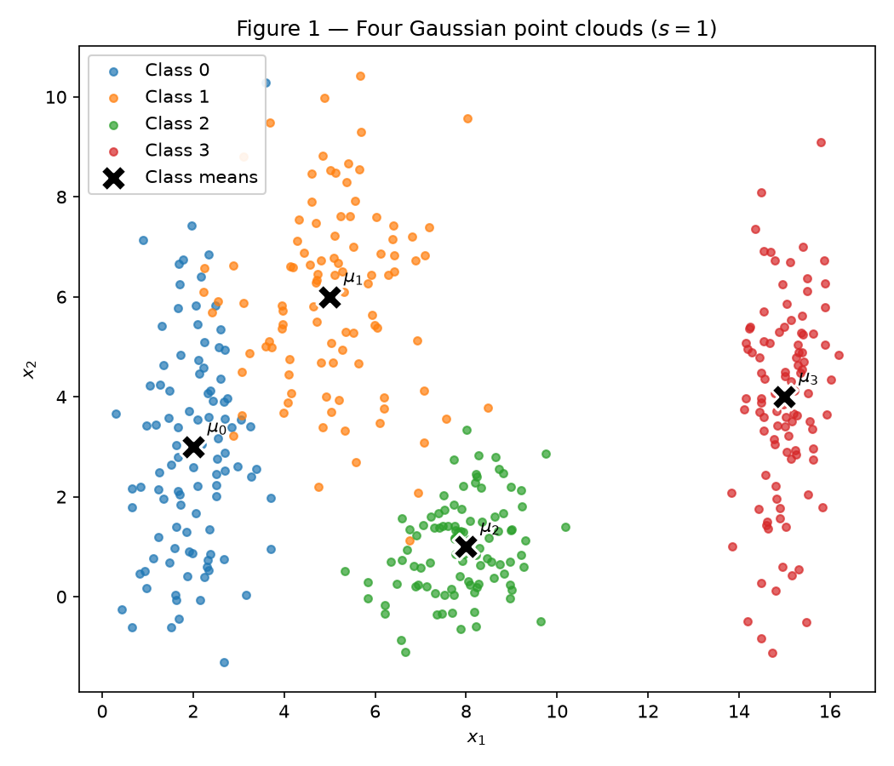
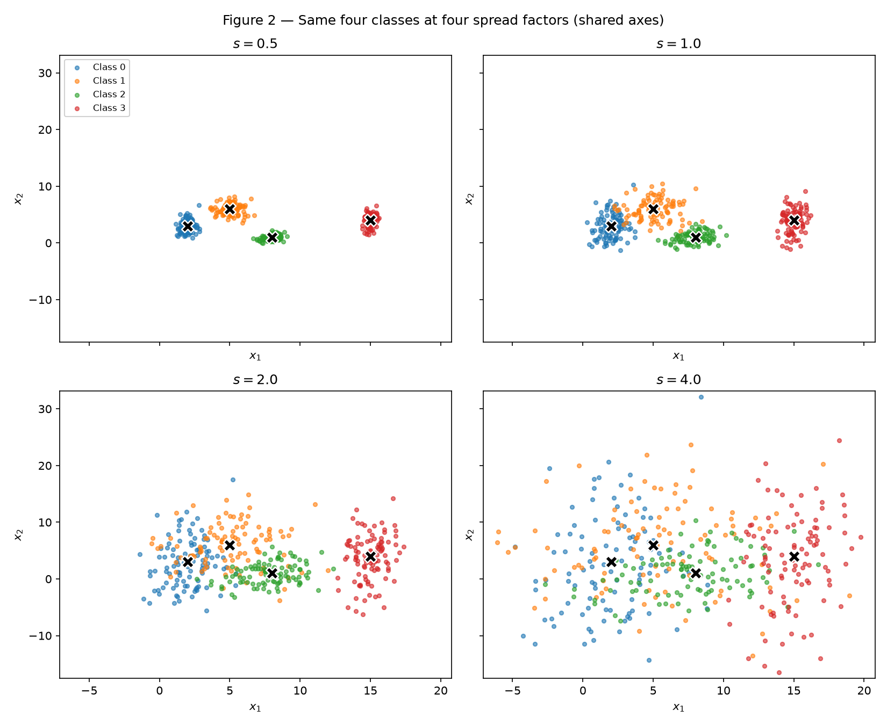
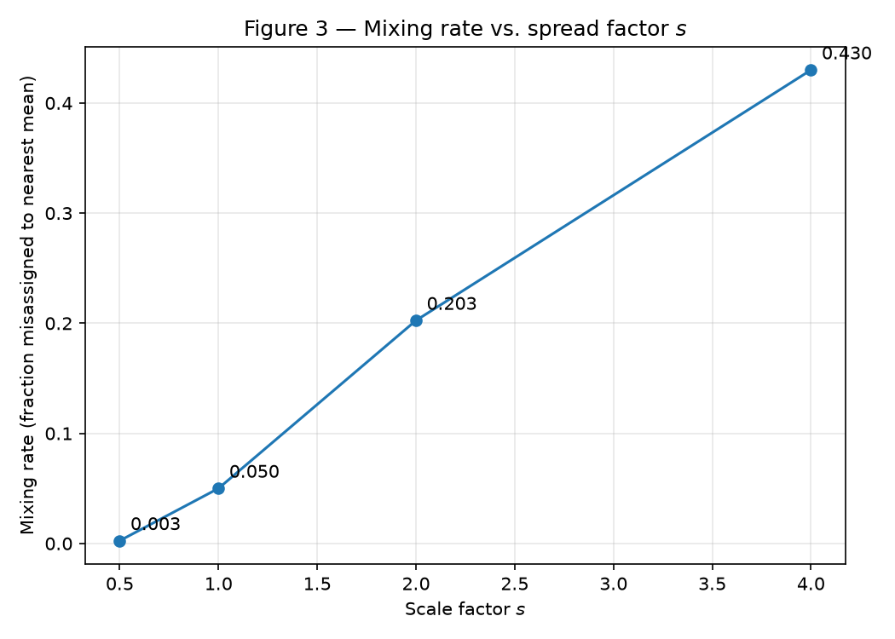
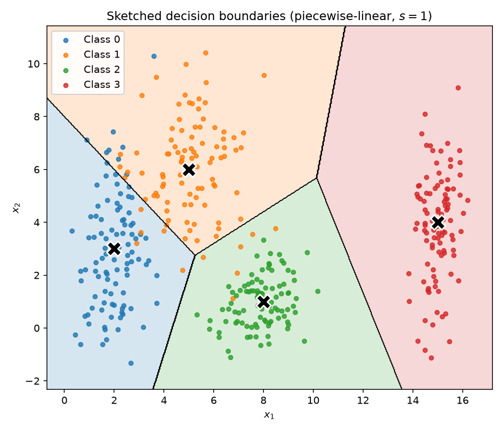

# Data — Preparation and Analysis for Neural Networks

!!! info "Deliverable"
    Individual · Deadline: 01 Sep 2026, 23:59 (commits).

Technical rules used throughout this report: a single fixed random generator
`rng = np.random.default_rng(42)`; every plot has a title, axis labels, and a
class legend; only `numpy`, `pandas`, `matplotlib`/`seaborn`, and `scikit-learn`
(PCA and preprocessing only) are used — no model is trained here.

## Exercise 1

### Point Clouds: Geometry and Spread in 2D

My approach: I draw one fixed set of standard-normal samples and turn it into a
cloud with `x = μ + (s·σ)·z`. Because the base draws `z` are reused for every
scale, `s = 1` reproduces item A exactly and each larger `s` is *the same* cloud
simply spread wider around an unchanged mean — which is what item B asks for. All
numbers below come from the script at the end of the exercise.

### A — Generate the clouds

I generated 400 samples (100 per class) from independent Gaussians with the given
per-axis means and standard deviations:

| Class | Mean | Std |
| --- | --- | --- |
| 0 | \([2, 3]\) | \([0.8, 2.5]\) |
| 1 | \([5, 6]\) | \([1.2, 1.9]\) |
| 2 | \([8, 1]\) | \([0.9, 0.9]\) |
| 3 | \([15, 4]\) | \([0.5, 2.0]\) |

/// caption
Figure 1 — Four Gaussian clouds (\(s = 1\)). The black **X** markers are the
class means \(\mu_0 \dots \mu_3\).
///

The clouds match the parameters: Class 0 is tall and narrow (large \(\sigma_y\)),
Class 2 is compact and round, Class 3 is a thin vertical strip far to the right.

### B — More or less spread out

I regenerated the same four classes at \(s \in \{0.5, 1.0, 2.0, 4.0\}\), scaling
every standard deviation while holding the means fixed. Plotted on shared axes so
the comparison is honest:

/// caption
Figure 2 — The four classes at \(s = 0.5, 1, 2, 4\) on identical axes. At
\(s = 0.5\) the clouds are tight islands; by \(s = 4\) they bleed across the whole
plane.
///

#### Separation ratios \(r_{ij}\) at \(s = 1\)

Using \(\bar{\sigma}_k = (\sigma_{k,x} + \sigma_{k,y})/2\) — so
\(\bar{\sigma} = [1.65, 1.55, 0.90, 1.25]\) — the six pairwise ratios
\(r_{ij} = \lVert \mu_i - \mu_j \rVert / (\bar{\sigma}_i + \bar{\sigma}_j)\) are:

| Pair \((i, j)\) | \(\lVert \mu_i - \mu_j \rVert\) | \(r_{ij}\) |
| --- | --- | --- |
| (0, 1) | 4.243 | **1.326** |
| (1, 2) | 5.831 | 2.380 |
| (0, 2) | 6.325 | 2.480 |
| (2, 3) | 7.616 | 3.542 |
| (1, 3) | 10.198 | 3.642 |
| (0, 3) | 13.038 | 4.496 |

The **smallest** ratio is the pair **(0, 1)** at \(r_{01} = 1.326\) — Classes 0
and 1 are the closest relative to their spread, exactly the overlap visible in
Figure 1. Since the means are fixed, \(r_{ij}\) scales with \(1/s\), so at
\(s = 2\) this smallest ratio halves to \(r_{01} = 0.663\) — no new data needed.

#### Mixing rate per scale

The mixing rate is the fraction of points whose nearest class **mean** is not
their own class (a purely geometric check against the four fixed means, nothing
trained):

| \(s\) | Mixing rate |
| --- | --- |
| 0.5 | 0.0025 |
| 1.0 | 0.0500 |
| 2.0 | 0.2025 |
| 4.0 | 0.4300 |

/// caption
Figure 3 — Mixing rate vs. \(s\). It climbs from essentially zero to 43% as the
clouds spread.
///

**From which scale can the clouds no longer be separated by straight lines?**
From \(s = 2\) onward. At \(s = 0.5\) and \(s = 1\) the mixing rate is tiny
(0.25% and 5%), so a set of straight-line boundaries still separates the classes
with only marginal error; at \(s = 2\) the mixing rate jumps to ~20% and the
clouds visibly interpenetrate in Figure 2, so no set of straight lines can
cleanly separate them. **What happens to the smallest \(r_{ij}\) there?** It falls
below 1 — \(r_{01} = 0.663\) at \(s = 2\) — meaning the gap between the two
closest centers is now *smaller* than the sum of their average spreads: the two
clouds overlap by construction.

### C — Analysis

**1. Overlap at \(s = 1\), and linear separability.** In the original dataset the
four clouds are mostly distinct, but Classes 0 and 1 overlap along the
\(x_1 \approx 3\text{–}6\) band (their \(r_{01} = 1.326\) is the smallest ratio),
and Class 1 brushes Class 2 near the bottom. Class 3 sits far to the right,
cleanly apart. A **single** linear boundary cannot separate all four classes: one
hyperplane only cuts the plane into two half-planes, and we have four regions.
A **set** of linear boundaries, however, can — the 5% mixing rate at \(s = 1\)
shows the classes are almost linearly separable, so a small number of straight
cuts (or the piecewise-linear boundaries an MLP learns) does the job with little
error.

**2. Sketched decision boundaries.** A trained network would carve the plane into
one region per class. The nearest-mean (Voronoi) partition is a good sketch of
what those piecewise-linear boundaries look like:

/// caption
Sketched decision boundaries — the nearest-centroid partition at \(s = 1\).
Each region is bounded by straight segments; only the handful of points on the
wrong side of the Class 0 / Class 1 border are misclassified.
///

**3. Relation to item B.** As the clouds spread (larger \(s\)), the region where
the network *necessarily* makes mistakes — the zone where two classes' points
genuinely overlap — grows. The boundaries barely move (the means are fixed), but
more points cross to the wrong side of them: this is precisely the mixing rate
rising from 0.25% at \(s = 0.5\) to 43% at \(s = 4\) in Figure 3. Beyond
\(s \approx 2\), where \(r_{01} < 1\), the overlap is unavoidable for any
boundary, straight or curved: the irreducible (Bayes) error region widens with
the spread.

### Code

The full, runnable code is the Jupyter notebook
[`code/ex1_point_clouds.ipynb`](code/ex1_point_clouds.ipynb) (rendered as
**Data — Ex. 1 (notebook)** in the navigation). It regenerates every figure above
and prints all the reported numbers, and runs top-to-bottom from a clean checkout.

## Exercise 2

### A — Dataset I: shifted Gaussians

_TODO_

### B — Dataset II: concentric shells

_TODO_

### C — Visualize and compare

_TODO_

### D — Analysis

_TODO_

## Exercise 3

### A — Get to know the data

_TODO_

### B — Split before you transform

_TODO_

### C — Preprocess

_TODO_

### D — Verify and visualize

_TODO_

## Results summary

| # | Item | Your value |
| --- | --- | --- |
| 1 | Mixing rate at \(s = 0.5\) | 0.0025 |
| 2 | Mixing rate at \(s = 1.0\) | 0.0500 |
| 3 | Mixing rate at \(s = 2.0\) | 0.2025 |
| 4 | Mixing rate at \(s = 4.0\) | 0.4300 |
| 5 | Smallest \(r_{ij}\) at \(s = 1.0\), and which pair | 1.326 — pair (0, 1) |
| 6 | Distance between centers — Dataset I | |
| 7 | Distance between centers — Dataset II | |
| 8 | Explained variance PC1 + PC2 — Dataset I | |
| 9 | Explained variance PC1 + PC2 — Dataset II | |
| 10 | Share of the positive class in `Transported` | |
| 11 | Mean and median of `FoodCourt` on the training set, before transforming | |
| 12 | Final `shape` of the training feature matrix | |
| 13 | Minimum and maximum of the training and test sets after scaling | |
