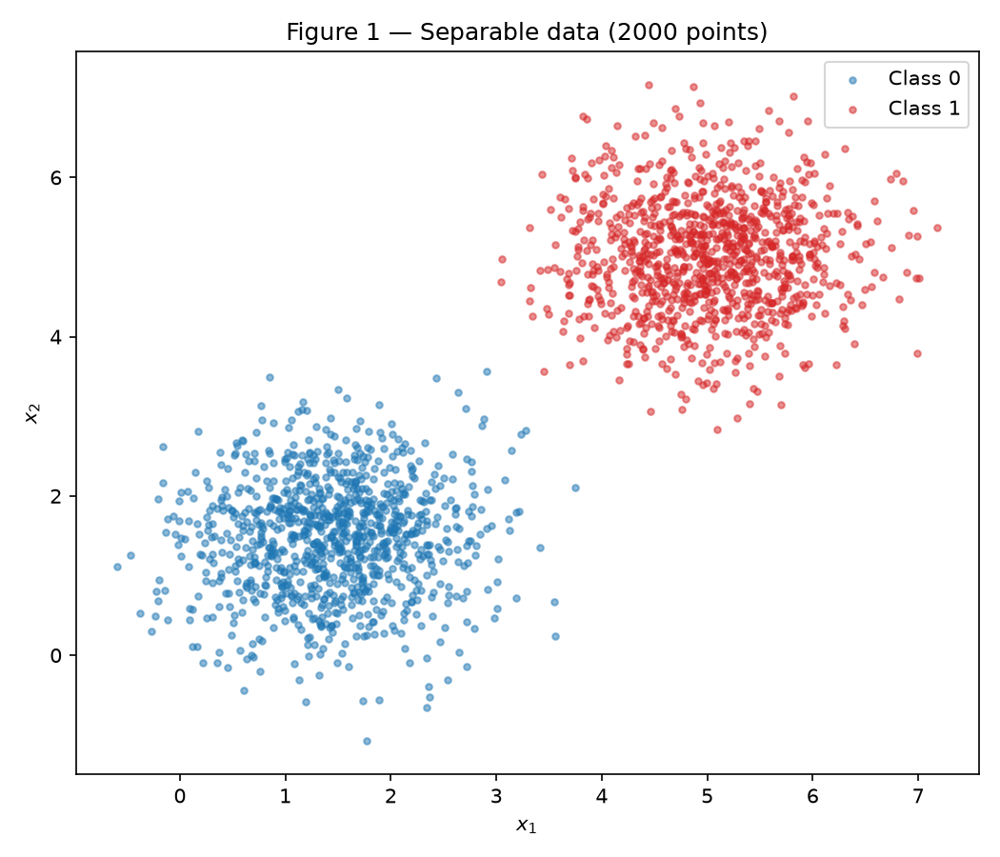
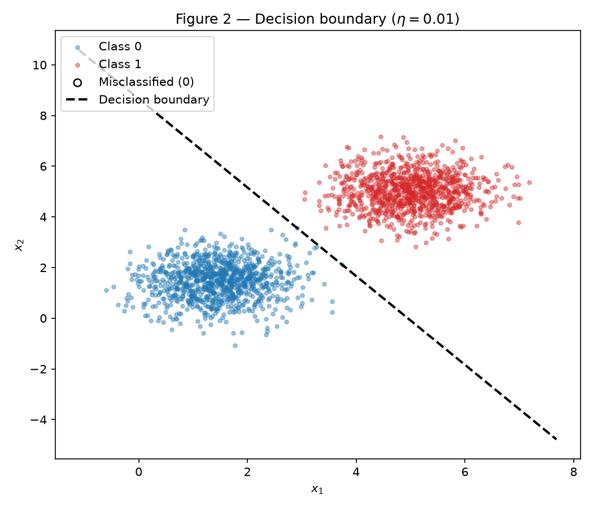
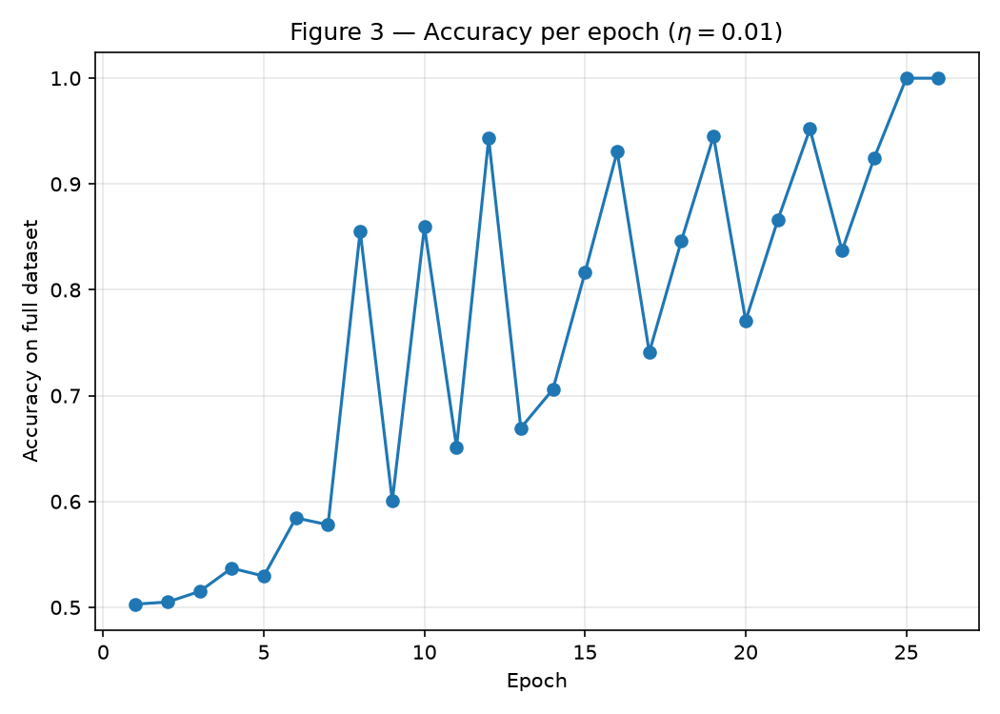
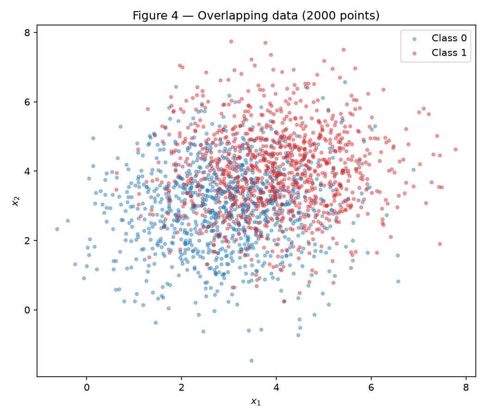
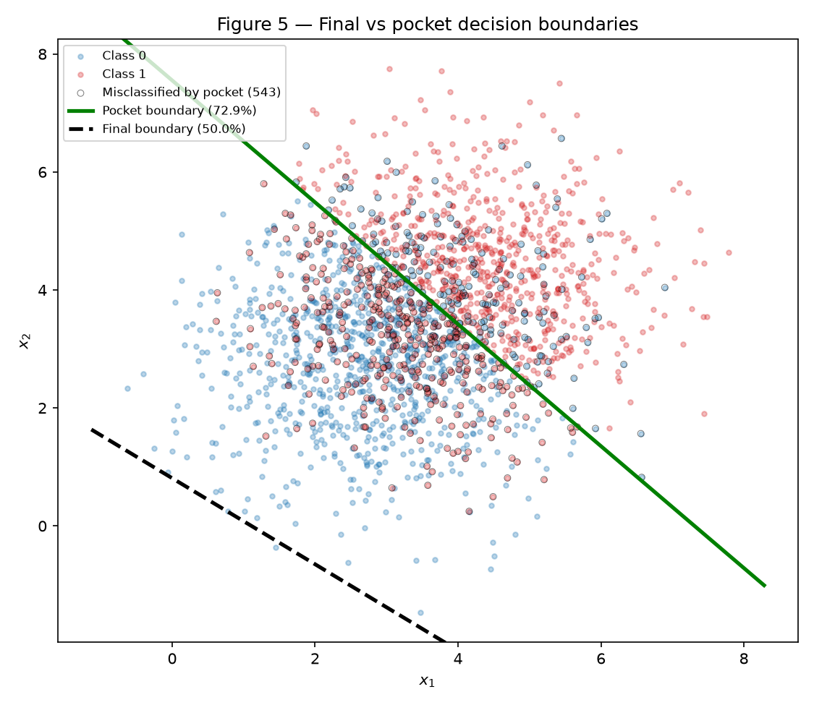
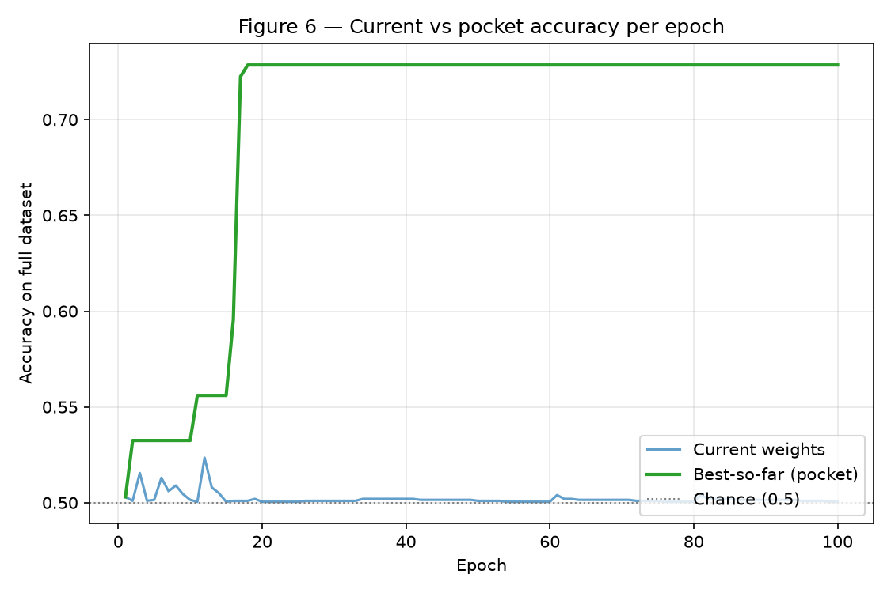

# Perceptron — Understanding Perceptrons and Their Limitations

!!! info "Deliverable"
    Individual · Deadline: 22 Sep 2026, 23:59 (commits).

**Approach.** I wrote a single-layer perceptron from scratch in `perceptron.py`
(NumPy only — no `scikit-learn` model) as one reusable class: the step activation,
the `{0,1}` error-driven update, and a training loop with an optional *pocket*.
The same class trains both a **separable** dataset (Exercise 1), where it converges
to 100%, and a **non-separable** one (Exercise 2), where it cannot and the pocket
algorithm keeps the best-so-far weights. The main subtlety was matching the update
rule to `{0,1}` labels (not the `±1` textbook form) and using a non-zero weight
initialization so the learning-rate study in item D is meaningful.

Technical rules used throughout: a single fixed generator
`rng = np.random.default_rng(42)`; every plot has a title, axis labels, and a class
legend; only `numpy`, `pandas`, `matplotlib`/`seaborn` are used, and the perceptron
is entirely my own code.

## Exercise 1 — Separable Data

### A — Generate the data

Two 2-D Gaussian clouds, 1000 points each: Class 0 \(\sim \mathcal{N}([1.5,1.5],
0.5 I)\) and Class 1 \(\sim \mathcal{N}([5,5], 0.5 I)\). The centers are ~5 units
apart while the per-axis standard deviation is only \(\sqrt{0.5}\approx 0.71\), so
the clouds are linearly separable.


/// caption
Figure 1 — 2000 points, one color per class. The two clouds are cleanly apart.
///

### B — Implement the perceptron

The model is written from scratch and reused unchanged in Exercise 2:

- **Prediction:** \(\hat{y} = \text{step}(\mathbf{w}\cdot\mathbf{x}+b)\), with
  \(\text{step}(z)=1\) if \(z\ge 0\) else \(0\).
- **Update (matched to \(\{0,1\}\) labels):**
  \(\mathbf{w} \leftarrow \mathbf{w} + \eta\,(y-\hat{y})\,\mathbf{x}\),
  \(b \leftarrow b + \eta\,(y-\hat{y})\). The error \((y-\hat{y})\) is \(0\) on a
  correct prediction, so only mistakes trigger an update.
- **Init:** \(\mathbf{w}\sim\) `rng.normal(0, 0.01, size=2)`, \(b=0\) (non-zero, see D.3).
- **Learning rate:** \(\eta = 0.01\).
- **Stopping:** a full pass with no update, or 100 epochs; accuracy recorded each epoch.

```python
--8<-- "docs/exercises/perceptron/code/perceptron.py"
```

### C — Train and measure

Training converged in **26 epochs** to **100% accuracy**, with final weights
\(\mathbf{w} = [0.0505,\ 0.0289]\) and bias \(b = -0.25\).


/// caption
Figure 2 — The learned boundary \(\mathbf{w}\cdot\mathbf{x}+b=0\) cleanly separates
the clouds; **0** points are misclassified.
///


/// caption
Figure 3 — Accuracy climbs (with oscillations, since a single update can shift the
boundary) and locks at 1.0 by epoch 25–26, after which a clean pass stops training.
///

### D — Analysis

**1. Why separable data converges quickly.** The update fires *only on mistakes*
(\(y-\hat{y}=0\) means no change). As the boundary moves into the gap between the
clouds, fewer points are misclassified, so the **number of updates per epoch falls
toward zero**; once a full pass makes no mistake, the stopping condition triggers.
The perceptron convergence theorem guarantees this happens in a finite number of
updates for separable data — here, 26 epochs.

**2. Learning-rate comparison (\(\eta=0.01\) vs \(\eta=1.0\)).** Same data, same
initialization, only \(\eta\) changed:

| \(\eta\) | epochs | final acc | \(\mathbf{w}\) | \(b\) | \(\mathbf{w}/\lVert\mathbf{w}\rVert\) |
| --- | --- | --- | --- | --- | --- |
| 0.01 | 26 | 1.0000 | \([0.0505, 0.0289]\) | \(-0.25\) | \([0.8681, 0.4963]\) |
| 1.0 | 37 | 1.0000 | \([5.871, 3.359]\) | \(-31.0\) | \([0.8679, 0.4967]\) |

Both reach 100%. The two weight **directions** are essentially identical (cosine
similarity \(1.0000\), angle \(0.02^\circ\)), but the **magnitudes** differ by ~100×
— exactly the ratio of the learning rates. This is the point of the hint: every
update adds \(\eta\,\mathbf{x}\) to weights that started at magnitude ~0.01, so with
\(\eta=1.0\) the accumulated updates (\(\approx \eta\lVert\mathbf{x}\rVert \approx
5\) per step) instantly dwarf the tiny init and \(\lVert\mathbf{w}\rVert\) grows to
~6.8, whereas with \(\eta=0.01\) it stays ~0.06. Because the boundary
\(\mathbf{w}\cdot\mathbf{x}+b=0\) is invariant to the overall scale of
\((\mathbf{w},b)\), the two lines share the same orientation; they differ only in
their offset \(-b/\lVert\mathbf{w}\rVert\) (\(\approx 4.30\) vs \(4.58\)), i.e. they
sit at slightly different places *within the separating margin* — both valid. So
**\(\eta\) controls the scale of the weights and where in the margin the boundary
lands (and the epoch count), not the final orientation** on cleanly separable data.

**3. Why a zero start would make \(\eta\) irrelevant.** Start from
\(\mathbf{w}_0=\mathbf{0},\ b_0=0\) and run training at rate \(\eta\). Claim: at
every step \(t\), \(\mathbf{w}^{(\eta)}_t = \eta\,\mathbf{a}_t\) and
\(b^{(\eta)}_t = \eta\,c_t\) for rate-independent \(\mathbf{a}_t, c_t\). By
induction: it holds at \(t=0\) (both sides zero). The prediction is
\(\hat{y}=\text{step}(\mathbf{w}_t\cdot\mathbf{x}+b_t)
=\text{step}(\eta(\mathbf{a}_t\cdot\mathbf{x}+c_t))
=\text{step}(\mathbf{a}_t\cdot\mathbf{x}+c_t)\) because \(\eta>0\) does not change a
sign. So \(\hat{y}\) — and therefore the error \((y-\hat{y})\) — is **identical for
every \(\eta\)**. The update then gives
\(\mathbf{w}_{t+1}=\eta\,\mathbf{a}_t+\eta(y-\hat{y})\mathbf{x}
=\eta\,\mathbf{a}_{t+1}\), closing the induction. Hence running with \(\eta_1\) and
\(\eta_2\) yields weights that differ only by the constant factor
\(\eta_2/\eta_1\); the decision boundary \(\{\mathbf{x}:\mathbf{a}\cdot\mathbf{x}+c=0\}\)
and the entire update sequence (so the epoch count) are identical. From a zero
start \(\eta\) has **no effect at all** — which is why item B forbids it.

## Exercise 2 — Overlapping Data (Pocket Algorithm)

### A — Generate the data

Two 2-D Gaussian clouds, 1000 points each: Class 0 \(\sim \mathcal{N}([3,3], 1.5
I)\) and Class 1 \(\sim \mathcal{N}([4,4], 1.5 I)\). The centers are only ~1.4 units
apart while the standard deviation is ~1.22 (three times the spread of Exercise 1),
so the clouds overlap heavily and **no straight line separates them**.


/// caption
Figure 4 — 2000 points; the two classes are thoroughly intermixed.
///

### B — Train, keeping the best weights

I reused the Exercise 1 perceptron **unchanged** (same \(\eta=0.01\), same 100-epoch
cap) with `pocket=True`: whenever an update produces a higher full-dataset accuracy
than any seen before, I copy \((\mathbf{w}, b)\) into the pocket. Because the data is
not separable, the loop never stops and runs all 100 epochs.

| Weights | \(\mathbf{w}\) | \(b\) | Accuracy |
| --- | --- | --- | --- |
| **Final** (last epoch) | \([0.0361, 0.0494]\) | \(-0.04\) | **0.5005** |
| **Pocket** (best-so-far) | \([0.0068, 0.0066]\) | \(-0.05\) | **0.7285** |

The final-iterate accuracy is ~50% — no better than guessing — while the pocket
holds ~72.85%, close to the best a straight line can do on this data. The best
pocket accuracy was first reached at **epoch 18**.

### C — Figures


/// caption
Figure 5 — The **pocket** boundary (green) cuts through the overlap sensibly
(~72.9%); the **final** boundary (dashed) has drifted to the edge of the cloud,
classifying almost everything as one class (~50%). Points misclassified by the
pocket are circled.
///


/// caption
Figure 6 — The current-weights accuracy (blue) oscillates around chance (0.5) and
never settles; the best-so-far pocket accuracy (green) climbs and plateaus at
~0.73 by epoch ~18.
///

### D — Analysis

**1. The gap between final (~50%) and pocket (~73%).** On non-separable data the
loop never stops updating, so the **final** weights are simply wherever the last
mistakes left them. Figure 5 shows the final boundary sitting *below* the cloud
(centered near \((3.5,3.5)\)): the final \(\mathbf{w}\) is tiny
(\(\lVert\mathbf{w}\rVert\approx 0.06\)) and \(b\approx -0.04\), so the line passes
far from the data centroid and nearly every point lands on one side — with balanced
classes that gives ~50%. The loop leaves it there because of the imbalance the hint
points to: each mistake moves \(b\) by only \(\eta = 0.01\), but moves
\(\mathbf{w}\) by \(\eta\lVert\mathbf{x}\rVert \approx 0.01\times 5 = 0.05\). The
orientation of \(\mathbf{w}\) therefore swings ~5× faster than the offset \(b\) can
travel, so \(b\) can never climb to the value (\(\approx -\mathbf{w}\cdot(3.5,3.5)\))
needed to place the line *through* the cloud — the final line keeps getting knocked
to the margin. The **pocket** sidesteps this entirely by remembering the
best-scoring weights ever visited (73%, ≈ the best possible straight line).

**2. Figure 3 vs Figure 6.** In Exercise 1 the accuracy curve **settles** at 1.0;
here it never settles — the current-weights curve bounces around 0.5 forever. The
**perceptron convergence theorem** guarantees that *if the training data is linearly
separable*, the algorithm finds a separating hyperplane in a finite number of
updates and then stops. This dataset **violates the linear-separability
assumption**, so there is no zero-error state to converge to: mistakes never cease,
updates never stop, and the iterate keeps oscillating.

**3. Do more epochs or a smaller \(\eta\) fix it? No.** From the update rule, every
epoch still contains misclassified (overlapping) points, so \((y-\hat{y})\ne 0\) for
some samples no matter how long we train — updates continue indefinitely and the
current iterate never converges; more epochs just add more oscillation, and the
pocket cannot exceed the ~73% ceiling of the best straight line. A smaller \(\eta\)
only rescales each step (and, per the D.3 argument, does not change which points are
misclassified — predictions depend on the *sign* of \(\mathbf{w}\cdot\mathbf{x}+b\),
which \(\eta\) alone cannot flip in a way that removes the overlap); it makes the
wandering finer but around the same poor region. The genuine overlap is a property
of the data, not of the training budget — the only real fix is a nonlinear model (or
accepting the pocket's best-line solution).

## Results summary

| # | Quantity | Value |
| --- | --- | --- |
| 1 | Exercise 1 — final \(\mathbf{w}\) and \(b\) | \(\mathbf{w}=[0.0505, 0.0289]\), \(b=-0.25\) |
| 2 | Exercise 1 — epochs to convergence | 26 |
| 3 | Exercise 1 — final accuracy | 1.0000 |
| 4 | Exercise 1 — epochs and final accuracy with \(\eta = 1.0\) | 37 epochs, 1.0000 |
| 5 | Exercise 2 — final \(\mathbf{w}\) and \(b\) | \(\mathbf{w}=[0.0361, 0.0494]\), \(b=-0.04\) |
| 6 | Exercise 2 — accuracy of the final weights | 0.5005 |
| 7 | Exercise 2 — accuracy of the pocket weights | 0.7285 |
| 8 | Exercise 2 — epoch at which the pocket best occurred | 18 |

## Code

The from-scratch model is
[`code/perceptron.py`](code/perceptron.py); the runnable notebooks are
[`code/ex1_separable.ipynb`](code/ex1_separable.ipynb) (rendered as
**Perceptron — Ex. 1 (notebook)**) and
[`code/ex2_overlap.ipynb`](code/ex2_overlap.ipynb) (**Perceptron — Ex. 2
(notebook)**). They generate the data, train the model, and produce Figures 1–6.

!!! info "AI-Use"
    AI helped write the NumPy/Matplotlib data-generation and plotting code. The analysis, interpretation, and conclusions are my own.
